# Knowledge Graph Generation from Unstructured Text

This project explores approaches for automatically generating knowledge graphs from unstructured textual documents.

The framework focuses on extracting **entities and relationships from PDF documents using Large Language Models (LLMs)** and storing the resulting graph in **Neo4j**. The project was developed as an experimental framework to explore current approaches to knowledge graph construction without requiring a dedicated supervised training phase.

The experiments use reports from the **Earth Negotiations Bulletin**, covering the United Nations climate negotiations (COP), with the goal of constructing one graph per document/year.

## Table of Contents

- [Overview](#overview)
- [Quick Start](#quick-start)
  - [Create a Python Virtual Environment](#1-create-a-python-virtual-environment)
  - [Install Dependencies](#2-install-dependencies)
  - [Configure Environment Variables](#3-configure-environment-variables)
  - [Run the Project](#4-run-the-project)
- [Experiments](#experiments)
  - [Research Objective](#research-objective)
  - [Dataset](#dataset)
  - [Background: Entity and Relationship Extraction](#background-entity-and-relationship-extraction)
  - [Approach](#approach)
- [Experimental Results](#experimental-results)
  - [Experiment 1 : Initial Extraction](#experiment-1--initial-extraction)
  - [Experiment 2 : Constrained Extraction](#experiment-2--constrained-extraction)
  - [Experiment 3 : Relationship Constraints](#experiment-3--relationship-constraints)
- [Application to Additional Documents](#application-to-additional-documents)
  - [COP 2002](#cop-2002)
  - [COP 1998](#cop-1998)
  - [COP 1996](#cop-1996)
- [Discussion](#discussion)
  - [Strengths](#strengths)
  - [Limitations](#limitations)
- [Future Work](#future-work)
- [References](#references)

---

## Overview

The main objective is to transform an unstructured textual document into a structured graph:

```text
PDF document
     │
     ▼
Text extraction
     │
     ▼
Entity & relationship extraction
     │
     ▼
Knowledge graph
     │
     ▼
Neo4j
```

In the experiments, **nodes represent actors**, such as countries, while **relationships represent interactions or relations extracted from the document**.

The project focuses on an LLM-based extraction approach, using prompting to generate graph structures directly from textual data.

---

## Quick Start

### 1. Create a Python Virtual Environment

It is recommended to use a virtual environment to isolate project dependencies.

#### Linux/macOS

```bash
python3 -m venv .venv
source .venv/bin/activate
```

#### Windows

```bash
python -m venv .venv
.venv\Scripts\activate
```

### 2. Install Dependencies

Once the virtual environment is activated:

```bash
pip install -r requirements.txt
```

### 3. Configure Environment Variables

The project requires credentials for Neo4j and OpenAI.

Copy the environment template:

```bash
cp .env.example .env
```

Then fill in the required values in `.env`:

```text
NEO4J_URL=bolt://localhost:7687
NEO4J_USERNAME=...
NEO4J_PASSWORD=...
NEO4J_DATABASE=neo4j

OPENAI_API_KEY=...
```

> **Important:** Never commit your `.env` file to version control. It is already included in `.gitignore`.

### 4. Run the Project

The current entry point is:

```bash
python main.py
```
The input data and pipeline can be directly configured in the main code.

---

# Experiments

## Research Objective

The experiments investigate how effectively LLM-based approaches can be used to construct knowledge graphs from unstructured textual documents.

More specifically, the objective is to:

- identify relevant entities from textual documents;
- extract relationships between entities;
- represent these relationships as graph structures;
- evaluate the resulting graphs qualitatively;
- investigate how prompting and extraction constraints affect the generated graph.

The experiments were conducted iteratively, starting from a single pilot document and progressively refining the extraction pipeline before applying it to additional documents.

---

## Dataset

The experiments use reports from the **Earth Negotiations Bulletin (ENB)**.

The dataset consists of reports from different editions of the **United Nations Climate Change Conferences (COP)**, with one report corresponding to a given conference/year.

The objective is to construct a separate graph for each document.

The expected graph structure is:

- **Nodes:** actors involved in the negotiations, particularly countries;
- **Edges:** relationships or interactions identified in the text;
- **Properties:** additional information extracted from the text, such as the verb or relation description.

---

## Background: Entity and Relationship Extraction

Several approaches can be used to extract structured information from unstructured text.

### Entity Extraction

| Approach | Description | Advantages | Limitations |
|---|---|---|---|
| Rule-based | Manually defined linguistic or lexical rules | Simple and interpretable | Domain-dependent and difficult to generalize |
| Frequency-based | Keyword extraction using techniques such as TF-IDF or co-occurrence | Simple and interpretable | May confuse entities with relationships |
| Supervised ML | Models trained on annotated corpora | Automated extraction | Requires annotated training data |
| Pre-trained models | Semantic keyword/entity extraction using embeddings | No task-specific annotations required | May confuse entities with relationships |
| Generative models / LLMs | Direct extraction using prompting | Semantic understanding and joint entity/relation extraction | Hallucinations and output instability |

### Relationship Extraction

| Approach | Description | Advantages | Limitations |
|---|---|---|---|
| Co-occurrence | Relationships inferred from entities appearing together within a text window | Simple and interpretable | Relationships are relatively poor in semantics |
| Supervised ML | Classification of text into predefined relationship types | Learns linguistic patterns automatically | Requires annotated data and predefined relation types |
| Pre-trained models | Triplet generation from text | Joint entity and relationship extraction | Computational cost and dependency on training data |
| LLM prompting | Triplet extraction using zero-shot or few-shot prompting | Flexible and requires little training data | Output instability, hallucinations and computational cost |

Given the recent development of LLM-based approaches, the experiments focus on **prompt-based extraction using LLMs**.

---

## Approach

Rather than training a dedicated information extraction model, the project uses an iterative LLM-based approach.

The methodology can be summarized as follows:

1. Select a pilot document.
2. Define the expected node and relationship types.
3. Run the extraction pipeline.
4. Inspect the resulting graph.
5. Identify extraction errors and unwanted nodes/relationships.
6. Refine the extraction constraints and prompts.
7. Re-run the experiment.
8. Apply the resulting pipeline to additional documents.

This iterative process was used to progressively improve the generated graph.

---

# Experimental Results

## Experiment 1 : Initial Extraction

The first experiment used a simple extraction pipeline to generate a graph from the pilot document.

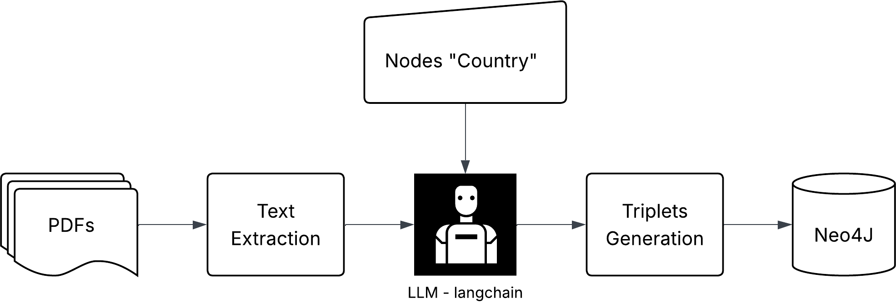

The resulting graph was:


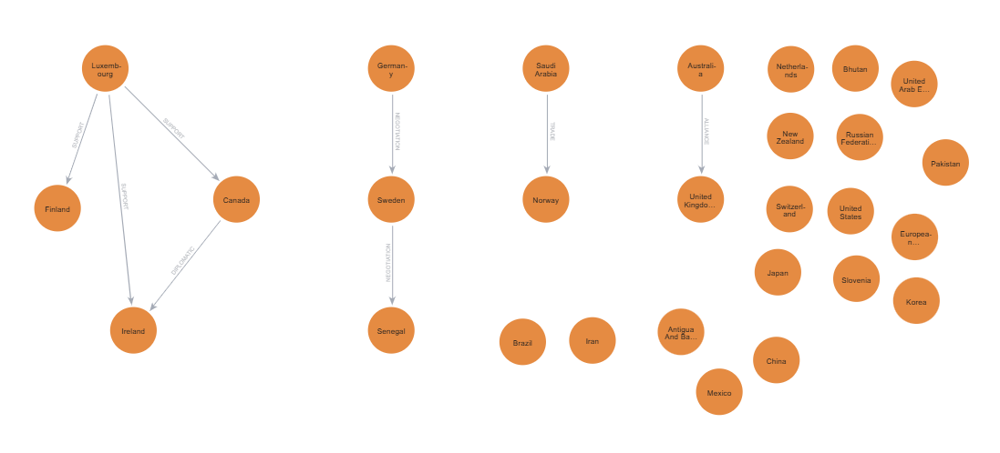

### Observations

The main issue observed was the presence of a large number of **isolated nodes without relationships**.

This suggests that the extraction pipeline was able to identify potential entities but did not consistently associate them with meaningful relationships.

---

## Experiment 2 : Constrained Extraction

The second experiment introduced additional constraints to better control the generated graph.

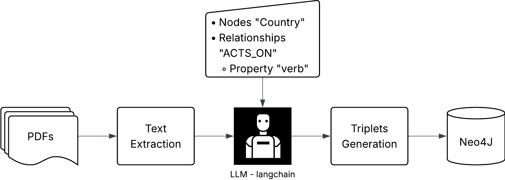

The resulting graph was:

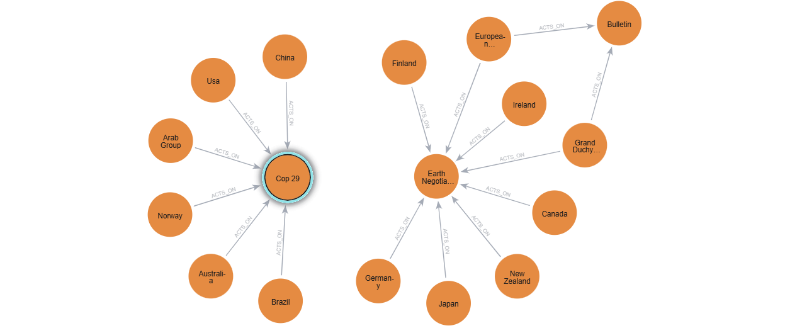

### Observations

Two main issues were identified:

- Some extracted nodes were not countries, despite the intended node schema.
- Some relationship properties contained textual descriptions rather than concise relationship labels.

For example, a property such as:

```text
verb = "rejected investment goal"
```

contains a phrase describing the relationship rather than a normalized relation type.

This highlighted the importance of constraining both the **allowed node types** and the **relationship representation**.

---

## Experiment 3 : Relationship Constraints

The third experiment further refined the extraction pipeline, particularly the set of allowed relationships.

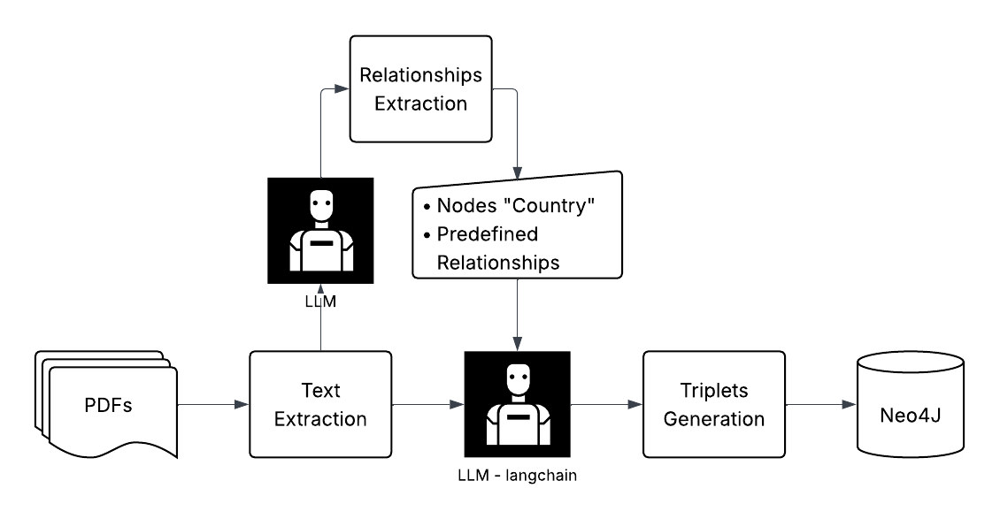


The relationship configuration was:

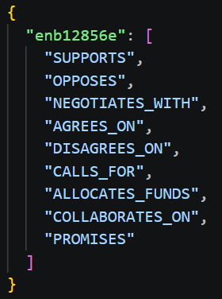

The resulting graph was:

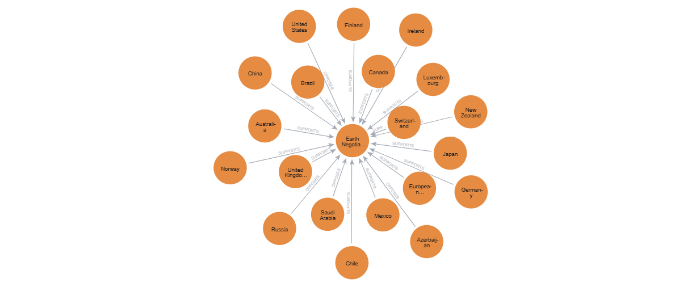

### Observations

The resulting graph was more constrained, but only **two of the predefined relationship types** were actually extracted.

Another recurring issue was the presence of **Earth Negotiations Bulletin** as a node, even though it is a reporting organization rather than a country.

This indicates that constraining the extraction schema alone is not sufficient to guarantee that all generated entities correspond to the intended semantic category.

---

# Application to Additional Documents

After iterating on the pilot document, the resulting pipeline (framework 3) was applied to additional COP reports.

The following experiments used reports from **COP 2002, COP 1998 and COP 1996**.

### COP 2002

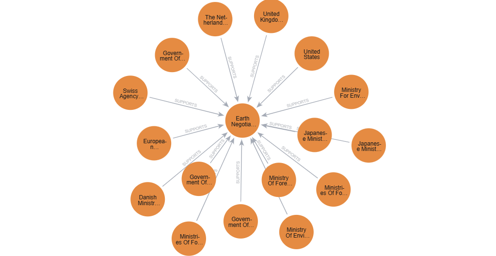

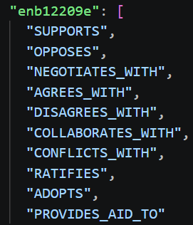

### COP 1998

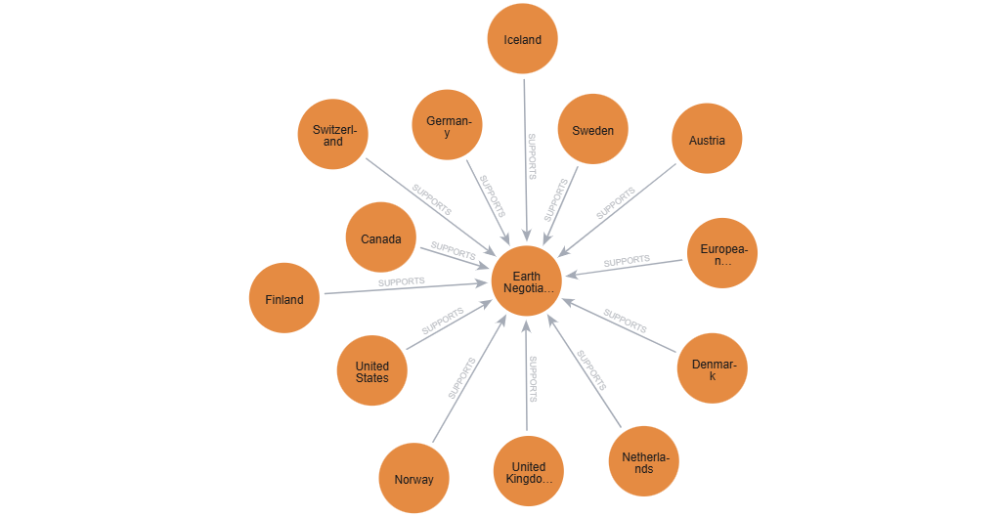

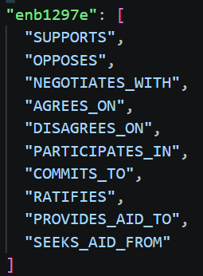

### COP 1996

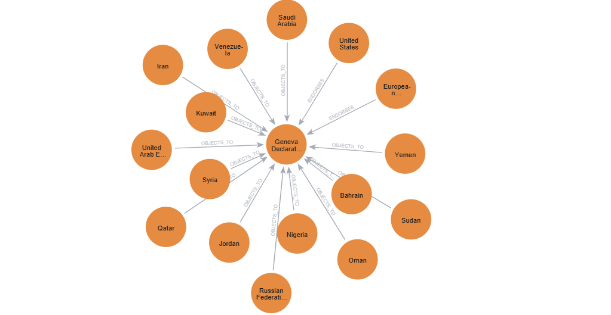

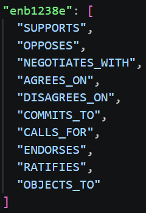

Applying the pipeline to different documents showed that the approach could be reused across reports without requiring a new training phase.

However, the qualitative issues observed during the pilot experiments remained relevant, particularly regarding entity filtering and the richness and consistency of extracted relationships.

---

# Discussion

## Strengths

The main advantage of the approach is the speed with which an extraction pipeline can be developed and iterated. Unlike supervised approaches, the pipeline does not require a dedicated annotated dataset for training. The extraction behavior can instead be modified through prompts and graph-schema constraints. LLMs can also be used as a preprocessing step to extract different types of relations.

## Limitations

Several limitations were identified during the experiments.

### Dependence on the LLM

The experiments relied on GPT-4o, which is not an open-source model. This choice was motivated by the fact that I could not run the models locally. The actual pipeline is therefore dependent on an external proprietary model.

An interesting direction would be to evaluate whether similar results can be obtained with open-source LLMs.

### Irrelevant entities

Some entities that do not correspond to the intended node type can appear in the generated graph.

For example, **Earth Negotiations Bulletin** was sometimes extracted as a node even though the experiments were primarily focused on countries.

This suggests that additional entity validation or post-processing could be useful.

### Relationship richness

The extracted relationships were sometimes too limited or difficult to normalize.

In particular, the experiments showed that the LLM may produce textual descriptions of interactions rather than a consistent set of relation types.

### Evaluation

One of the main challenges is evaluating the quality of the generated graphs.

Unlike standard classification or named entity recognition tasks, graph generation combines several dimensions:

- entity identification;
- entity normalization;
- relationship identification;
- relationship classification;
- graph structure.

A robust evaluation methodology would therefore be necessary to quantitatively compare different extraction strategies.

---

# Future Work

Several improvements could be explored:

- **CLI support** for specifying input documents directly.
- **Configuration files** for node types, relationship types and extraction parameters.
- **Modular extraction strategies** to easily compare different approaches.
- **Few-shot prompting** to provide examples of the desired extraction format.
- **Alternative LLMs**, including open-source models.
- **Entity validation and normalization** to remove irrelevant or inconsistent nodes.
- **Relationship normalization** to map free-text descriptions to a controlled vocabulary.

---

# References

The main references used during the experiments include:
- [Bakker et al. (2024)](https://scholarlypublications.universiteitleiden.nl/handle/1887/4283601)
- [Yamamoto et al. (2025)](https://ceur-ws.org/Vol-4085/paper49.pdf)
- [Issa et al. (2023)](https://ieeexplore.ieee.org/document/10295108)
- [Zhu et al. (2024)](https://link.springer.com/article/10.1007/s11280-024-01297-w)
- [Kumar et al. (2017)](https://arxiv.org/abs/1705.03645)
- [Peng et al. (2017)](https://aclanthology.org/Q17-1008/)
- [Huguet Cabot et al. (2021)](https://aclanthology.org/2021.findings-emnlp.204/)
- [Medium: Building Knowledge Graphs with LLM Graph Transformer](https://medium.com/data-science/building-knowledge-graphs-with-llm-graph-transformer-a91045c49b59)
